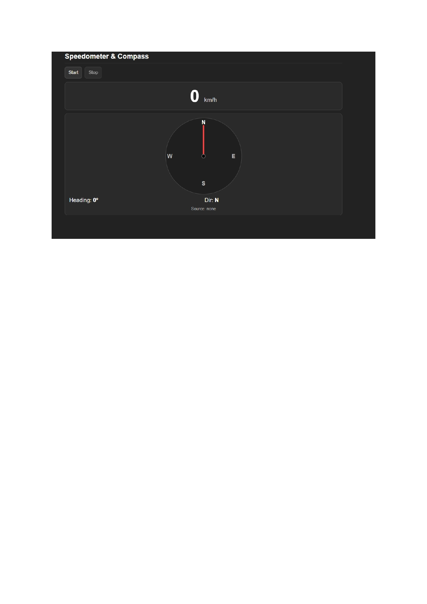
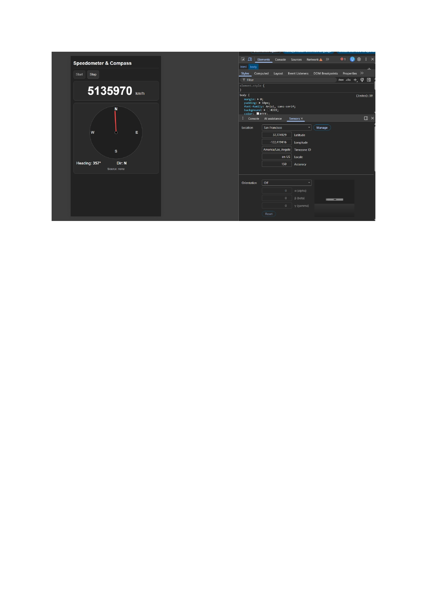

# 🧭 Reto JS — Speedometer & Compass  
**Día 21 del curso JavaScript30**

Este proyecto es una implementación del ejercicio **"Geolocation based Speedometer and Compass"** del curso **JavaScript30**, creado por Wes Bos.  

El objetivo es construir un **velocímetro y brújula en tiempo real** usando únicamente HTML, CSS y JavaScript vanilla, aprovechando la API de Geolocalización y los sensores de orientación del dispositivo.

---

## 📌 Descripción del Reto

La aplicación muestra en tiempo real:

✅ **Velocidad actual** en km/h calculada mediante GPS  
✅ **Dirección (heading)** hacia donde te diriges:
- Ángulo en grados (0°-360°)
- Dirección cardinal (N, NE, E, SE, S, SW, W, NW, etc.)
- Aguja visual animada en una brújula circular

✅ **Fuente de datos** utilizada (GPS o sensor de orientación)

La app funciona mejor en dispositivos móviles con GPS activo, pero también puede ejecutarse en navegadores de escritorio.

---

## 🛠 Tecnologías Utilizadas

- **HTML5** → Estructura semántica de la interfaz
- **CSS3** → Diseño oscuro minimalista con brújula visual
- **JavaScript Vanilla** → Lógica de geolocalización, cálculos matemáticos y actualización del DOM

**APIs utilizadas:**
- `navigator.geolocation.watchPosition()` → Monitoreo continuo de posición GPS
- `DeviceOrientationEvent` → Sensor de orientación del dispositivo
- Fórmula de **Haversine** para calcular distancias entre coordenadas
- Cálculo de **bearing** para determinar rumbo entre dos puntos

---

## 📂 Estructura del Proyecto

```
IngWebRetoJs/
├── index.html    # Página principal (HTML + CSS + JS embebido)
└── README.md     # Documentación del proyecto
```

---

## 🚀 Instrucciones de Instalación

### Opción 1: Ejecución Local

1. **Clona este repositorio:**
   ```bash
   git clone https://github.com/tu-usuario/speedometer-compass-js.git
   cd speedometer-compass-js
   ```

2. **Abre el archivo `index.html` en tu navegador**

3. **Importante:** Para que funcione correctamente:
   - Usa **HTTPS** o `localhost` (requisito del navegador para acceder al GPS)
   - En iOS/Safari, toca **Start** para solicitar permisos de orientación
   - Pruébalo en **exteriores o en movimiento** para ver datos reales

### Opción 2: Despliegue Online

🌐 **Demo en vivo:** [Ver proyecto desplegado](#) *(Próximamente)*

---

## 📸 Capturas de Pantalla

### Vista Principal


*Velocímetro mostrando 0 km/h y brújula apuntando al Norte*

### En Movimiento


*Brújula actualizándose en tiempo real mientras el usuario se mueve*

---

## 🧠 Funcionamiento Técnico

### 1️⃣ Cálculo de Velocidad
```javascript
// Si el GPS no proporciona velocidad, se calcula manualmente
const p1 = {lat: lastPos.coords.latitude, lon: lastPos.coords.longitude};
const p2 = {lat: c.latitude, lon: c.longitude};
const dt = (now - lastTime) / 1000;
const d = distance(p1, p2); // Haversine
if (dt > 0 && d >= 0.5) spd = d / dt;
```

### 2️⃣ Suavizado con EMA (Exponential Moving Average)
```javascript
speedSmooth = speedSmooth + 0.3 * (spd - speedSmooth);
```

### 3️⃣ Cálculo de Heading
```javascript
// Prioridad: GPS heading > Bearing entre puntos > Orientación del dispositivo
let gpsH = null;
if (c.heading && spd > 0.5) {
  gpsH = wrap(c.heading);
} else if (lastPos) {
  if (distance(p1, p2) > 2) gpsH = angle(p1, p2);
}
```

### 4️⃣ Animación de la Brújula
```javascript
needle.style.transform = `translate(-50%, -100%) rotate(${deg}deg)`;
```

---

## ✨ Mejoras Implementadas

- ✅ Código JavaScript optimizado (~150 líneas)
- ✅ Suavizado de datos para eliminar fluctuaciones
- ✅ Fallback automático entre GPS y sensor de orientación
- ✅ Diseño responsive y minimalista
- ✅ Manejo de permisos en iOS/Safari
- ✅ Pausar sensores al minimizar la app

---

## 🎯 Posibles Mejoras Futuras

- [ ] Agregar mapa con trayectoria recorrida
- [ ] Guardar historial de velocidades
- [ ] Mostrar altitud y precisión del GPS
- [ ] Modo nocturno/diurno
- [ ] Alertas de velocidad máxima
- [ ] Exportar datos de la sesión

---

## 👨‍💻 Autor

**Paul Alejandro Larrea Aguilar**

Proyecto desarrollado como parte del aprendizaje de JavaScript puro y APIs del navegador.

---

## 📚 Recursos

- [Curso JavaScript30](https://javascript30.com/) por Wes Bos
- [MDN - Geolocation API](https://developer.mozilla.org/es/docs/Web/API/Geolocation_API)
- [MDN - DeviceOrientationEvent](https://developer.mozilla.org/es/docs/Web/API/DeviceOrientationEvent)
- [Fórmula de Haversine](https://en.wikipedia.org/wiki/Haversine_formula)

---

## 📄 Licencia

Este proyecto es de código abierto y está disponible bajo la licencia MIT.

---

💡 **Nota:** Este proyecto requiere permisos de ubicación y orientación. Asegúrate de aceptarlos cuando el navegador lo solicite.
